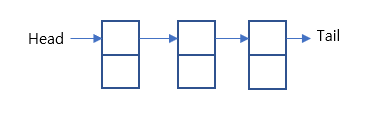
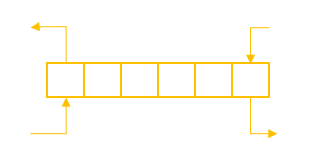
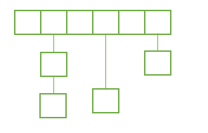
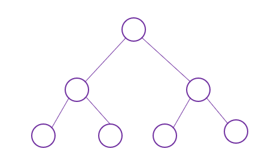
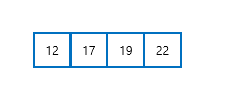

## 들어가기 전에

많은 양의 데이터를 관리하는 방법에는 어떤 것이 있을까요? 사용자의 복잡한 명령어를 컴퓨터는 어떻게 효율적으로 처리할까요? 이러한 역할을 하는 자료구조에 대해 살펴보도록 하겠습니다.

### 학습 목표

앞으로 배울 자료구조의 종류와 정의를 설명할 수 있습니다.

### 핵심 단어

- 연결 리스트 

- 스택, 큐 

- 체인해시 

- 트리 

- 정렬

## 생각해보기

1) 일상 생활에서 정리를 할 때 어떻게 정리를 하는 것이 효율적이였나요? 
