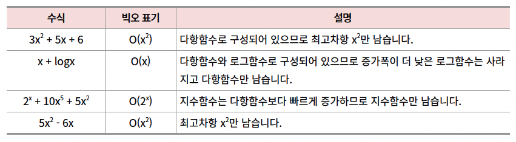
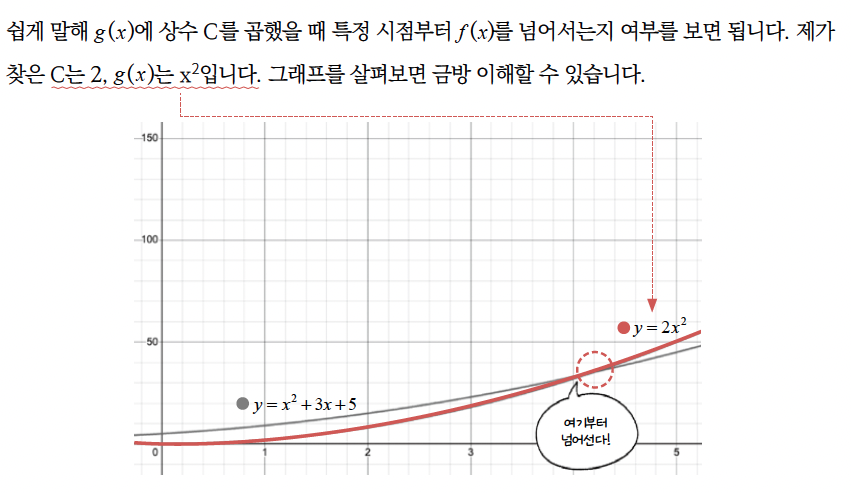
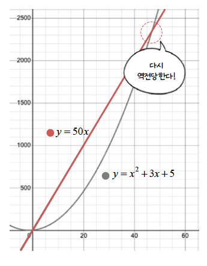
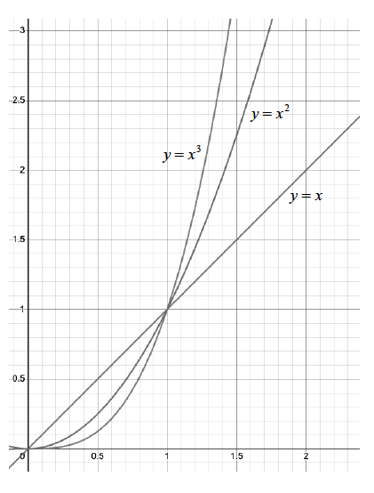
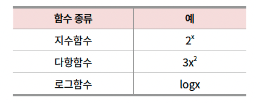
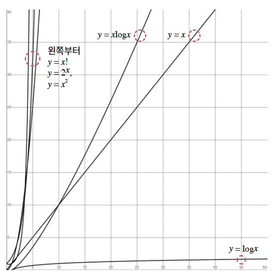

## 03 알고리즘의 효율 분석
프로그램의 성능 = 시간 복잡도

### 시간 복잡도(time complexity)란
알고리즘의 성능을 나타내는 지표로, 입력 크기에 대한 연산 횟수의 상한을 의미함

- 코딩 테스트의 문제에는 '가장 효율적으로 해결하는 알고리즘’이 있음
- 하문제 풀 수 있는 알고리즘이 여럿 있을 경우 제한 시간(시간복잡도)를 기준으로 선정해야함
- 낮으면 낮을수록 좋음

### 알고리즘 수행 시간
- 절대시간 측정
  - 프로그램을 실행하는 환경에 따라 달라질 수 있어서 코딩 테스트에서는 잘 활용하지 않음
- 시간복잡도 측정
  - 연산 횟수
  - 알고리즘이 시작한 순간부터 결괏값이 나올 때까지의 연산 횟수
  - 최선`best`, 보통`normal`, 최악`worst`
  - 점근적 표기법 : 입력 크기에 따른 연산 횟수의 추이를 활용해서 시간 복잡도를 표현하는 방법

### 빅오 표기법 big-O notation
- 최악의 경우 시간 복잡도를 표현
- 연산 횟수가 f(x) = 2x^2 + 3x + 5라면 시간 복잡도를 O(x^2)과 같이 표현




### 빅오 표기법을 쉽게 쓸 때 최고차항만 남기고 차수를 지우는 이유

    - f(x)=x2+3x+5에서 최고 차항인 x^2만 남김
    - x^2는 앞의 차수가 1이므로 제거할 것이 없음
    - 시간 복잡도는 O(x^2)

### 빅오 표기법으로 최악의 시간 복잡도를 표기하는 방법

``` java
public static void main(String[] args) {
  solution(6);
}

public static void solution(int n) {
  int count = 0;

  for (int i = 0; i < n; i++) {
    for (int j = 0; j < n; j++) {
      count++;
    }
  }

  for (int i = 0; i < n; i++) {
    count++;
  }

  for (int i = 0; i < n * 2; i++) {
    count++;
  }

  for (int i = 0; i < 5; i++) {
    count++;
  }

  System.out.println(count);
}
``` 

solution( ) 함수는 주석 영역별로 각각 n^2, n + 2n 5번의 증가 연산을 하며 결과값은 곧 연산 횟수를 의미합니다. 
지금의 경우 solution(6)을 호출하면 6^2 + 3*6 + 5

즉, 연산 횟수는 59입니다. 이때 solution( ) 함수는 식으로 다음과 같이 표현할 수 있습니다.

- f(x) = x^2+3x+5

이때 다음을 만족하는 C가 있으면 f(x)의 최악의 시간 복잡도는 O(g(x))




그래프를 보면 대략 x = 4부터 항상 2x^2가 f(x)를 넘으므로 위 공식을 만족한다.

`“g(x) = x, C = 50인 경우 x에 값을 몇 개 넣어보니 f(x)보다 값이 크네...? ` 그렇다면 시간 복잡도는 O(x)라고 해도 되는 것 아닐까?”

- 시간 복잡도는 일시적 비교가 아니라, 무한히 큰 x에서의 비교다.
- f(x) ≤ C * g(x)가 x ≥ x₀일 때 항상 성립해야 함.
- 즉, "몇 개 넣어서 맞네?"가 아니라
  - x가 엄청 커질수록 그 관계가 항상 유지되어야 하는 것임
- 50x는 대략 x=47에서 다시 역전당하기 때문에 시간 복잡도는 O(x^2)

### 🔍 x에 몇 개 넣어보면?

| x | f(x) = x² + 3x + 5 | 50x (C × x) |
|---|--------------------|-------------|
| 1 | 1² + 3×1 + 5 = 9   | 50          |
| 2 | 4 + 6 + 5 = 15     | 100         |
| 3 | 9 + 9 + 5 = 23     | 150         |
| 4 | 16 + 12 + 5 = 33   | 200         |

> ✅ 어? 몇 개 넣어보니 `f(x) < 50x` 인데?


### 😮 그런데 x가 커지면?

| x     | f(x) = x² + 3x + 5         | 50x        |
|--------|------------------------------|-------------|
| 100    | 10000 + 300 + 5 = **10305**  | **5000**    |
| 200    | 40000 + 600 + 5 = **40605**  | **10000**   |
| 1,000  | 1000000 + ... = **엄청큼!** | **50000**   |

> ❗ x가 커질수록 **f(x)**는 `50x`보다 훨씬 커진다!


### ✅ 결론
초반에는 f(x) ≤ 50x였지만

x가 커질수록 f(x)는 50x보다 훨씬 빨리 커짐

→ f(x)는 O(x)가 아니다! ❌

→ f(x)는 O(x²) 이 맞는 표현




그래프를 보면 데이터가 커질수록 세 그래프의 차이는 확연히 벌어진다. x값이 무한하게 커지면 그 격차는 더 심하다는 것.

- x^3에 비해 x와 x^2는 무시할 수 있을 정도로 작을 겁니다.



로그함수는 다항함수보다 느리게 증가하고, 지수함수는 다항함수보다 빠르게 증가합니다.

- 그러므로 최고차항만 남기는 작업에서 우선 순위는 다음과 같을 겁니다.



이 우선 순위대로면 다항함수와 로그함수가 섞여 있을 때 로그함수를, 지수함수와 다항함수가 섞여 있다면 다항함수를 지워야 할 것




### 시간 복잡도를 코딩 테스트에 활용하는 방법
코딩 테스트 문제에는 제한 시간이 있으므로 문제를 분석한 후에 빅오 표기법을 활용해서 해당 알고리즘을 적용했을 때 제한 시간 내에 출력값이 나올 수 있을지 확인해볼 수 있습니다.


## 🧠 시간 복잡도 함수의 증가 속도 순위

| 순위 | 함수       | 시간 복잡도 표기 | 특징 / 예시                     |
|------|------------|-------------------|----------------------------------|
| 1️⃣  | log x      | `O(log N)`        | 이진 탐색 등, 매우 빠름         |
| 2️⃣  | x          | `O(N)`            | 단순 반복문                     |
| 3️⃣  | x log x    | `O(N log N)`      | 정렬 (Merge Sort, Heap Sort 등) |
| 4️⃣  | x²         | `O(N²)`           | 이중 for문, 완전탐색            |
| 5️⃣  | x³         | `O(N³)`           | 삼중 for문                      |
| 6️⃣  | 2^x        | `O(2^N)`           | 백트래킹, 부분 집합 탐색        |
| 7️⃣  | x!         | `O(N!)`           | 순열, 완전탐색 (Brute Force)     |

> 📌 **x가 무한히 커질수록**, 지수·팩토리얼 함수는 다항식보다 훨씬 빨리 증가합니다.  
> 따라서 Big-O를 계산할 때는 **최고차항만 남기는 이유**가 바로 여기에 있습니다.


## ✅ 시간 복잡도 예시 - Java 코드 버전

### 🔸 예시 1: 버블 정렬 → `O(N²)`

```java
void bubbleSort(int[] arr) {
    int n = arr.length;
    for (int i = 0; i < n; i++) {
        for (int j = 0; j < n - 1; j++) {
            if (arr[j] > arr[j + 1]) {
                // swap arr[j] and arr[j+1]
                int temp = arr[j];
                arr[j] = arr[j + 1];
                arr[j + 1] = temp;
            }
        }
    }
}
```

### 🔸 예시 2: 병합 정렬 (Merge Sort) → `O(N log N)`

```java
void mergeSort(int[] arr, int left, int right) {
    if (left < right) {
        int mid = (left + right) / 2;
        mergeSort(arr, left, mid);
        mergeSort(arr, mid + 1, right);
        merge(arr, left, mid, right);
    }
}

void merge(int[] arr, int left, int mid, int right) {
    int n1 = mid - left + 1;
    int n2 = right - mid;

    int[] L = new int[n1];
    int[] R = new int[n2];

    for (int i = 0; i < n1; ++i) L[i] = arr[left + i];
    for (int j = 0; j < n2; ++j) R[j] = arr[mid + 1 + j];

    int i = 0, j = 0, k = left;
    while (i < n1 && j < n2) {
        if (L[i] <= R[j]) {
            arr[k++] = L[i++];
        } else {
            arr[k++] = R[j++];
        }
    }

    while (i < n1) arr[k++] = L[i++];
    while (j < n2) arr[k++] = R[j++];
}
```

- 배열을 반으로 자름: `N → N/2 → N/4 → ... → 1`
  - 총 나누는 단계 수 = log₂N
```text
          [전체 N개]
           ↓ 분할
      [N/2]      [N/2]
       ↓          ↓
   [N/4] [N/4] [N/4] [N/4]
     ... 계속 반으로 쪼개기 (log N번)
           ↓ 병합 (한 단계당 N번)

```

### ❓ 왜 O(N²)보다 빠를까?
- 버블/삽입/선택 정렬은 두 원소를 계속 비교 → `O(N²)`
- 반면, 병합/퀵 정렬은 전체 구조를 잘게 쪼개서 효율적으로 정렬 → `O(N log N)`


### 🔸 예시 3: 부분집합 구하기 (DFS) → `O(2^N)`
```java
void generateSubsets(int[] arr, int idx, List<Integer> subset) {
    if (idx == arr.length) {
        System.out.println(subset);
        return;
    }

    // 현재 원소 포함
    subset.add(arr[idx]);
    generateSubsets(arr, idx + 1, subset);

    // 현재 원소 미포함
    subset.remove(subset.size() - 1);
    generateSubsets(arr, idx + 1, subset);
}
```
```java
// 사용 예시
int[] arr = {1, 2, 3};
generateSubsets(arr, 0, new ArrayList<>());
```

